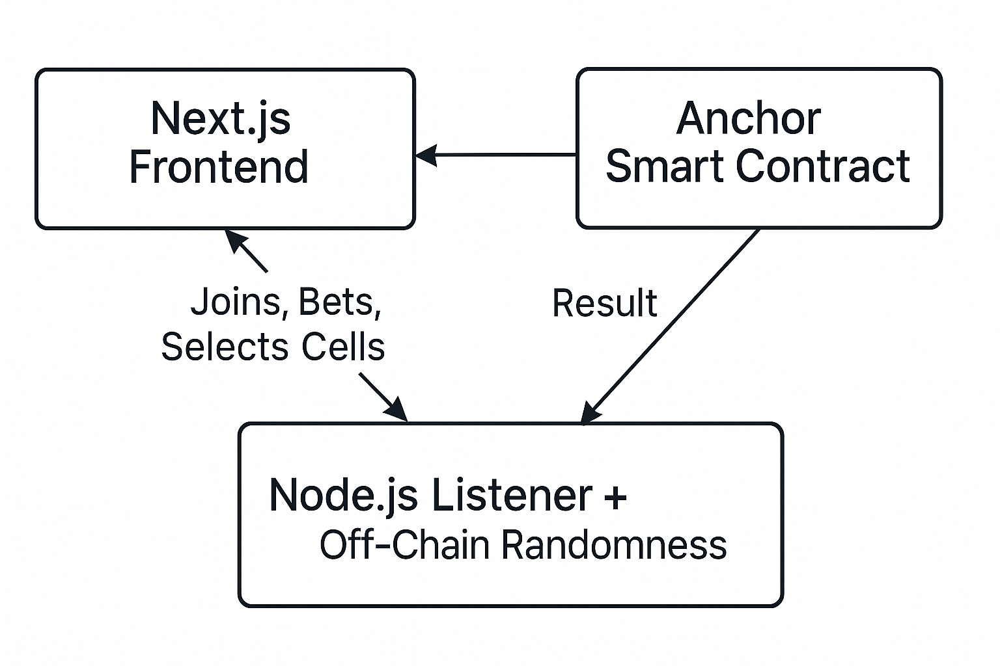

# 🎰 FriendzCasino

A **room-based casino platform** on **Solana** where friends can create rooms, bet together, and play fun on-chain games like Mines!

> 👥 Create rooms, invite friends, place bets, and let the smart contract decide the winners based on fairness and cryptographic randomness.

---

## 🛠️ Tech Stack

- **Frontend**: [Next.js](https://nextjs.org/) ⚛️
- **Server**: Node.js 🟢
- **Blockchain**: [Solana](via Anchor Framework)

---

## 🎮 Available Game: Mines

### 💡 Game Flow

1. **Create a Room**
   - Go to the sidebar and click `Create Room`.
   - Enter a `roomId` and `betAmount`.

2. **Join the Room**
   - Players select the `Mines` game and join using the `roomId`.

3. **Place Bets**
   - Each joined player must place a bet to become an active participant.

4. **Start the Game**
   - Only the **room leader** can start the game.
   - The leader sets:
     - Number of **mines**
     - Number of **gems**

5. **Server Commits Random Mines**
   - On `GameStartedEvent`, the server:
     - Randomly generates mine positions.
     - Submits a **hash of the mines** to the Anchor program (not the actual positions yet).

6. **Players Submit Moves**
   - Players choose and submit cell positions.

7. **Reveal Mines**
   - Once all players have submitted, the **leader** triggers mine reveal.
   - The server sends the **actual mine positions**.
   - The smart contract:
     - Regenerates the hash from submitted positions.
     - Verifies it matches the earlier hash.

8. **Result & Payout**
   - ✅ If hash is valid:
     - Highest scorers (can be multiple) win.
     - Entire bet pool is split among winners.
   - ❌ If hash is invalid (e.g., tampering or server error):
     - All players get their bets refunded.

---

## 🔒 Security & Fairness
- Commit-Reveal Scheme
- Randomness is **off-chain generated** but **hash committed on-chain** for integrity.
- No player knows mine positions in advance.
- Smart contract **verifies hashes** before revealing results.

---

## 🚀 Coming Soon

- 🎲 More games: Roulette, Dice, and more!
- 🧑‍🤝‍🧑 Public Rooms & Leaderboards
- 📱 Mobile-optimized experience

---

## 🏗️ Architecture

## Video tutorial
https://www.loom.com/share/676231fa51204a40b3ba049b83bd7495?sid=1536f6d5-5c46-488e-b4a9-a8926ca642a4

