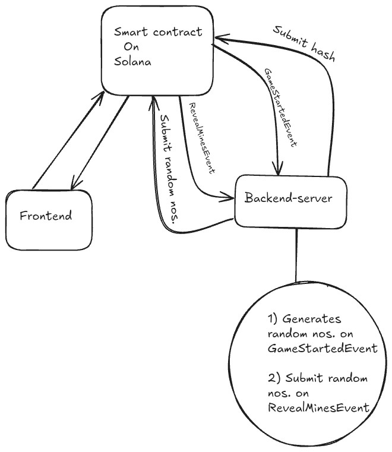

# 🎰 FriendzCasinoOnSolana

A **room-based casino platform** on **Solana** where friends can create rooms, bet together, and play fun on-chain games like Mines!

> 👥 Create rooms, invite friends, place bets, and let the smart contract decide the winners based on fairness and cryptographic randomness.

---

## 🛠️ Tech Stack

- **Frontend**: [Next.js](https://nextjs.org/) ⚛️
- **Server**: Node.js 🟢
- **Blockchain**: Solana

---

## ❗ Problem

### 🧍‍♂️ Gambling is lonely and centralized

1. Popular platforms like **Stake** only let users play against the house.
2. There’s no way to play casino games **directly with friends**.
3. The **entire game logic and randomness** are controlled by a centralized backend.

### 🔍 Lack of transparency and control

---

## 🌟 Vision (Solution)

### 🧑‍🤝‍🧑 Social, Transparent, Decentralized Gambling

FriendzCasinoOnSolana offers a new model for online gambling:

- 🎯 **Room-based multiplayer games** where friends can bet and play together.
- 🔐 **Smart contracts enforce fairness** — no centralized control over outcomes or funds.
- 🎲 **Commit-reveal randomness** ensures that no one can tamper with the result.
- 💬 **Collaborative gameplay** builds trust and fun through shared experiences.
- 🌍 **On-chain integrity** guarantees transparency, immutability, and fairness in every game.

---

## 🧬 What Makes FriendzCasinoOnSolana Unique?

Unlike most casino platforms or even Web3 games, **FriendzCasinoOnSolana is built entirely on-chain**.

### 💯 100% On-Chain Multiplayer Experience

- 🏗️ **Room creation, joining, and player management** all happen via Solana smart contracts.
- 🧑‍🤝‍🧑 No off-chain matchmaking or session tracking — the **blockchain itself is the game server**.
- 🚫 No WebSockets or centralized state sync — game state and interactions are updated and retrieved entirely through **on-chain transactions and events**.

### ✅ Why This Matters

- **Transparency**: Every player action and game event is recorded on-chain for public verification.
- **Trustless Play**: You don't have to trust any backend server — the smart contract *is* the backend.
- **No Middlemen**: Even multiplayer coordination (room IDs, player counts, turns) is handled trustlessly.
- **Auditable Gameplay**: Anyone can replay or verify games by scanning the chain.

---

## 🎮 Available Game: Mines

### 💡 Game Flow

1. **Create a Room**
   - Go to the sidebar and click `Create Room`.
   - Enter a `roomId` and `betAmount`.

2. **Join the Room**
   - Players select the `Mines` game and join using the `roomId`.

3. **Place Bets**
   - Each joined player must place a bet to become an active participant.

4. **Start the Game**
   - Only the **room leader** can start the game.
   - The leader sets:
     - Number of **mines**
     - Number of **gems**

5. **Server Commits Random Mines**
   - On `GameStartedEvent`, the server:
     - Randomly generates mine positions.
     - Submits a **hash of the mines** to the Anchor program (not the actual positions yet).

6. **Players Submit Moves**
   - Players choose and submit cell positions.

7. **Reveal Mines**
   - Once all players have submitted, the **leader** triggers mine reveal.
   - The server sends the **actual mine positions**.
   - The smart contract:
     - Regenerates the hash from submitted positions.
     - Verifies it matches the earlier hash.

8. **Result & Payout**
   - ✅ If hash is valid:
     - Highest scorers (can be multiple) win.
     - Entire bet pool is split among winners.
   - ❌ If hash is invalid (e.g., tampering or server error):
     - All players get their bets refunded.

---

## 🔒 Security & Fairness
- Commit-Reveal Scheme
- Randomness is **off-chain generated** but **hash committed on-chain** for integrity.
- No player knows mine positions in advance.
- Smart contract **verifies hashes** before revealing results.

---

## 🚀 Coming Soon

- 🎲 More games: Roulette, Dice, and more!
- 🧑‍🤝‍🧑 Public Rooms & Leaderboards
- 📱 Mobile-optimized experience

---

## 🏗️ Architecture

## Video tutorial
https://www.loom.com/share/676231fa51204a40b3ba049b83bd7495?sid=1536f6d5-5c46-488e-b4a9-a8926ca642a4

